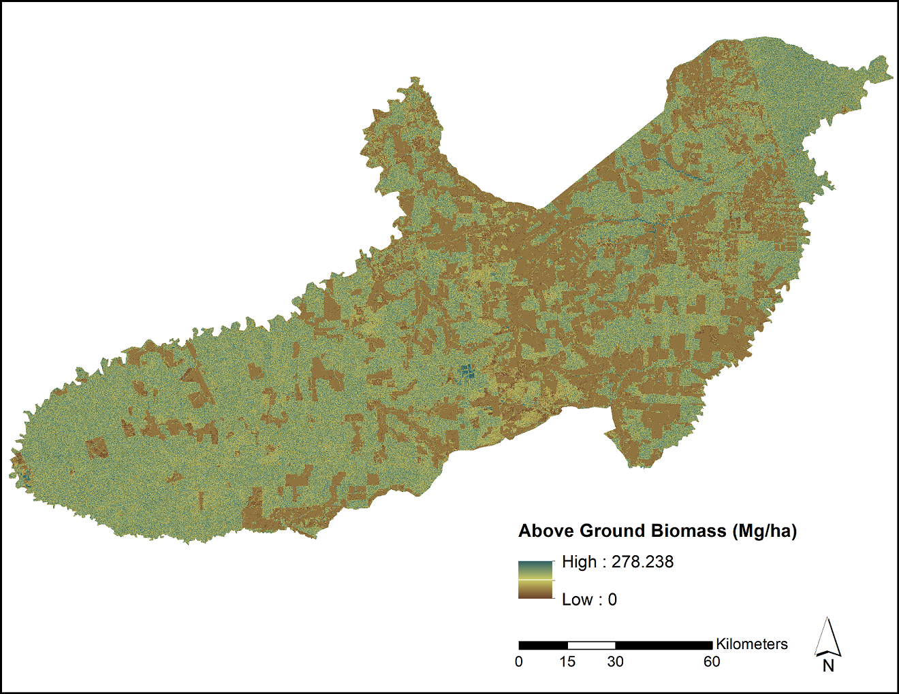

# Measurement and Assessment Methods of Forest Aboveground Biomass

The measurement and assessment of aboveground tree biomass (bole, branches, and
foliage), or M, plays a key role in the management of forest resources. Estimates are required
for evaluating: a) the stocks and fluxes of several biogeochemical elements and b) the
amount of primary energy obtainable from forests as an alternative to fossil fuels. Moreover,
biomass is a fundamental state variable in several ecological and eco-physiological models
(Brown, 1997; Chavé et al., 2005; Návar, 2009a,b; Richardson et al., 2002). The development
and use of allometric equations is the standard methodology for the estimation of tree, plot,
and regional aboveground biomass (Brown, 1997). Dry weight measurements conducted on
harvested trees, fresh and dry weights of biomass components and recording independent
tree variables are required to construct allometric equations at the species, stands or tree
community levels. Alternate M assessment methods include the multiplication of bole
volume by its wood specific gravity; with branch and foliage biomass integrated using other
approaches. Standing bole volume, V, can be also multiplied by biomass expansion factors,
BEF, at the tree level or stand scale to compute M. Allometric biomass equations can be
classified according to the parameter estimation method as empirical, semi-empirical and
process, theoretical models. Using three meta-analysis datasets, empirical equations are
reported in log-linear (82.6%), non-linear (12.0%), seemingly un-related (3.9%), linear (0.7%),
and non-linear seemingly un-related (0.6%) regression. Diameter at breast height, D, and at
the bole base, Db, canopy height, H, canopy area, CA, and wood specific gravity, ρw, are
common exogenous variables that individually or in combination explain M with deviations
larger than 16% of the mean measured tree aboveground biomass value (Chavé et al., 2005).
A fully theoretical, physically parameterized model is available (West et al., 1997), although
preliminary evaluations demonstrate that it requires further refinement before can be
recommended as a non-destructive M assessment methodology. More flexible, restrictive
models that make use of only a small number of harvested trees and fit available allometric
equations result in good M approximations (Zianis & Mencuccini, 2004). Semi-empirical
non-destructive models based on shape-dimensional analysis and assuming a constant
exponent value are being tested for simple and complex forests with compatible preliminary
M assessments (Návar, 2010a,b). This wealth of information on biomass allometry
necessitates be properly describing, organizing, and classifying in order to better
understand weakness and robustness of available methods to compute tree and eventually
plot and regional aboveground biomass. For places deprived of tree allometry, a
combination of a wide range of allometric equations developed off site appears to improve
tree M evaluations according to the Central Limit Theorem.
Biomass stocks and their spatial distribution remain poorly evaluated at the plot scale
regardless of the wealth of information on tree biomass allometry (Chavé et al., 2003;
Houghton et al., 2001, 20015; Návar et al., 2010). The conventional methodology that
expands tree M to sample inventory stands is: a) a grid of sampling plots and b) allometric
equations fit tree data recorded in the forest inventory, since there is scarce information on
allometric equations that straightforward calculate plot or stand M. New approaches that
employ timber volume are named BEF and at the present they require calibration to
appraise local plot M (Brown, 2002). Uncertainties of more than two orders of magnitude are
identified when calculating plot M by applying different off site allometric models to forest
inventory datasets and main sources of variation are: a) the error due to tree measurements,
b) ground sampling uncertainty, and above all, c) the error due to the choice of an allometric
model relating M to other tree dimensions (Chavé et al., 2003; Návar et al., 2010).
Tree or plot M interpolates at larger spatial scales, AGB, by a variety of field measurements,
environmental gradients and remote sensing techniques (Houghton, 2005a,b). A diversity of
remote sensing techniques, spatial resolutions, tree and forest attributes, and interpolation
methodologies make AGB assessment highly variable, with uncertainties as large as three
orders of magnitude. Main sources of variation are attributable to: a) the precision of
estimated tree or stand M, b) the interpolation method applied, c) the lack of a good
correlation between ground and remote sensing data, d) the correct location of ground data,
e) the representativeness of plots across the landscape, f) temporal variations in the satellite
image, g) the correct area of each forest class, and h) others. Combining remote field data
collection techniques (LIDAR) with locally-derived tree allometry and the semi-empirical
shape-dimensional non-destructive model of tree M assessment would eventually improve
AGB at the spatial scale of interest.
Given this brief literature review, the reliable M estimation of trees, plots, stands or tree
communities remains a key challenge for the successful implementation of sustainable forest
management plans. This paper deals with the description of available tree allometry, how
they contrast to provide tree, plot and regional M assessments and what are the future
challenges ahead. Preliminarily observations point towards the combination of available
conventional allometric models with restrictive, semi-empirical and theoretical nondestructive methods of tree or plot M evaluation while universally-applied functions
emerge. In addition, the interpolation of improved tree or plot M appraisals to regional
scales with a combination of field techniques, environmental gradient approaches and
remote sensing methods must eventually improve AGB assessments at regional and
national spatial scales.
Key words: Measuring and assessing aboveground biomass, empirical, semi-empirical,
theoretic models, tree, stand and regional scales. 

